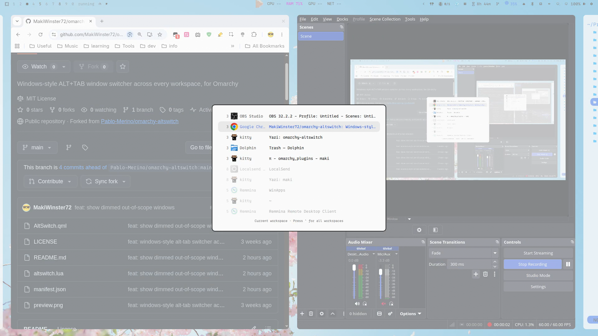

# Alt-tab switcher

Windows-style `ALT`+`TAB` for [Omarchy](https://omarchy.org/). Cycles windows
on the current workspace, ordered by most recently used.

Hold `ALT`, tap `TAB` to move down the list, release `ALT` to jump to the
highlighted window.



## Behaviour

| Keys | Action |
| --- | --- |
| `ALT`+`TAB` | Open the switcher and select the previous window |
| `ALT`+`TAB` again, `ALT` still held | Move one further down the list |
| `ALT`+`SHIFT`+`TAB` | Move back up the list |
| Hold `ALT`, release `TAB`, then press `A` | Toggle current-workspace/global scope immediately |
| Release `ALT` | Switch to the highlighted window |
| `ALT`+`ESCAPE` | Cancel without switching |

Two things make this behave like Windows rather than like Hyprland's
`cyclenext`:

- The window list is snapshotted when the switch starts and then frozen, so the
  order cannot shuffle underneath you while you tab through it.
- Selection is virtual. Focus moves once, when you release `ALT`. Focusing on
  every tap would drag you across workspaces on the way past.

Special and scratchpad workspaces are excluded. In current-workspace mode,
all normal windows stay visible, but rows from other workspaces are dimmed and
skipped by keyboard selection. Global mode makes every row selectable. A hint
in the system language (Chinese or English) shows the active scope and the
`A` toggle while the switcher is open.

## Requirements

- Omarchy Quattro, for the shell plugin system
- Hyprland 0.56 or newer, configured in Lua

No other dependencies, and nothing to install beyond this repository.

## Install

Add the plugin and enable it:

```bash
omarchy plugin add https://github.com/MakiWinster72/omarchy-altswitch.git --enable
```

Then load the keybindings from `~/.config/hypr/bindings.lua`:

```lua
dofile(os.getenv("HOME") .. "/.config/omarchy/plugins/io.github.makiwinster72.altswitch/altswitch.lua")
o.bind("ALT + A", "Toggle Alt-Tab workspace scope", "omarchy-shell altswitch scope toggle")
```

Open the switcher with `ALT`+`TAB`, keep holding `ALT`, release `TAB`, then
press `A` to switch the visible list immediately between current-workspace and
global mode.

The fork defaults to the current workspace when it has at least two windows.
With zero or one window there, it falls back to the global list automatically.
Scope can be changed at runtime and persists in `~/.config/omarchy/shell.json`;
no Hyprland reload is needed.

That line replaces Omarchy's four default `ALT`+`TAB` bindings (`cyclenext` and
`bring_to_top`, in both directions). It unbinds them itself, so no other edit is
needed.

## Settings

Application icons are shown by default. Hide them with:

```bash
omarchy-shell altswitch set showIcons false
```

| Command | Effect |
| --- | --- |
| `omarchy-shell altswitch set showIcons true` | Show application icons |
| `omarchy-shell altswitch set showIcons false` | Hide application icons |
| `omarchy-shell altswitch scope current` | Switch only within the current workspace |
| `omarchy-shell altswitch scope all` | Switch across every normal workspace |
| `omarchy-shell altswitch scope toggle` | Toggle between current and all |

Changes apply immediately and persist in the plugin's entry in
`~/.config/omarchy/shell.json`. While holding `ALT` after opening the switcher,
pressing the bound scope-toggle key updates selection and row emphasis
immediately.

The equivalent manual setting is:

```json
{ "id": "io.github.makiwinster72.altswitch", "showIcons": true, "scope": "current" }
```

## Remove

Delete the `dofile` line from `~/.config/hypr/bindings.lua`, then:

```bash
hyprctl reload
omarchy plugin remove io.github.makiwinster72.altswitch
```

Omarchy's default `ALT`+`TAB` bindings come back on the next reload.

## How it works

The plugin is two halves that talk over Omarchy's shell IPC.

`altswitch.lua` runs inside Hyprland and owns all state and all keys. It reads
the window list from `hl.get_windows()`, sorted by Hyprland's own
`focus_history_id`, and drives the panel with `omarchy-shell altswitch
show|select|hide`.

`AltSwitch.qml` runs inside `omarchy-shell` and only draws the list. It takes no
keyboard focus, so it cannot trap your keyboard, and it hides itself after ten
seconds if an `ALT` release is ever missed.

Two Hyprland details are worth knowing if you plan to modify this:

- Committing on `ALT` release cannot be a keybind. A release bind on a modifier
  only fires when that modifier is tapped alone; pressing `TAB` in between
  cancels it. The raw `input.keyboard.key` event stream is read instead.
- Focusing a window from inside a key callback updates Hyprland's active window
  but does not settle until the next input event, so the focus dispatch is sent
  through `hyprctl` from outside that callback.

## Known limitations

- Keys that the switcher does not bind still reach the window underneath while
  the list is open. Blocking them needs an exclusive keyboard grab, which risks
  trapping the keyboard if a switch is ever left open.
- There are no window thumbnails.

## License

[MIT](LICENSE)
